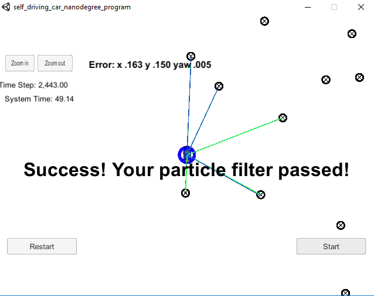

# Kidnapped Vehicle Project

## The Code
The modifed code is in the src directory.

# Implementing the Particle Filter
The directory structure of this repository is as follows:

## Success Criteria

1. **Accuracy**: your particle filter should localize vehicle position and yaw to within the values specified in the parameters `max_translation_error` and `max_yaw_error` in `src/main.cpp`.

- Here is a snapshot of the particle filter results with 10 partices. It has an error of for x of 0.163 for y an error of 0.150m, and for yaw an error of 0.005 radians.

2. **Performance**: your particle filter should complete execution within the time of 100 seconds.

- As shown in the above screenshot, the simulation was completed in under 50s.

### Hyperparameter Tuning

There was one paramter to tune, the number of particles.
We tried 10, 100, 1000, and 10000. At 10000 particles, the filter was over the time limit.

The table below lists particle number versus results. The reported errors are the errors report at the final point.
All runs were within the maximum allowed translation error and yaw angle error.

| Particles        | Final Report Errors (x(m),y(m),$\theta$(rad)) | Time (s)  | Pass | 
| ------------- |:-------------:| -----:|
| 10      | (0.163, 0.150, 0.005) | 49.14  | Yes |
| 100     | (0.115, 0.110, 0.004) | 48.94  | Yes |
| 1000    | (0.109, 0.102, 0.004) | 50.54  | Yes |
| 10000   | (0.108, 0.099, 0.004) | 220.02 | No |

Clearly, the time to run the simulation is the same untile the number of particles exceeds 1000 particles, while the error improves at 100 partilces significantly and then less so in the step between 100 and 1000. Here the optimal particle number is about 1000 since it runs in about the same time as 10 and has lower translational errors. The yaw error is improved but was not a big change.

### Summary
The particle filter implemented here was straight forward compared to the EKF and UKF and is more able to handle more complex problems. 
The optimal number of particles was 1000. The errors did none improve much after 1000 particles as the coverage was sufficient for the uncertainties in this problem. More particles increased simulation time without a commensurate improvement in the error.

